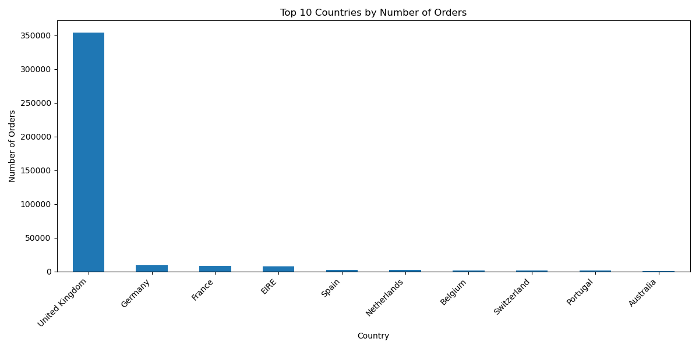
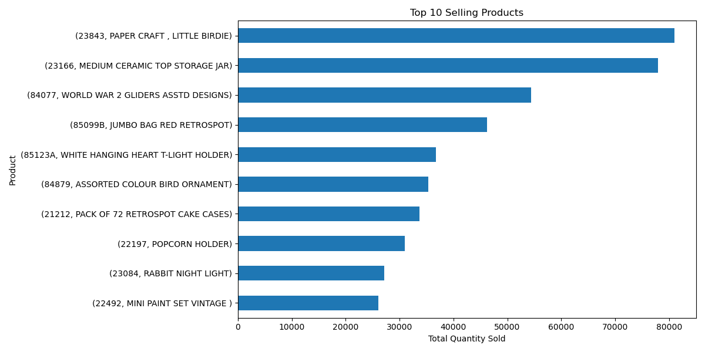
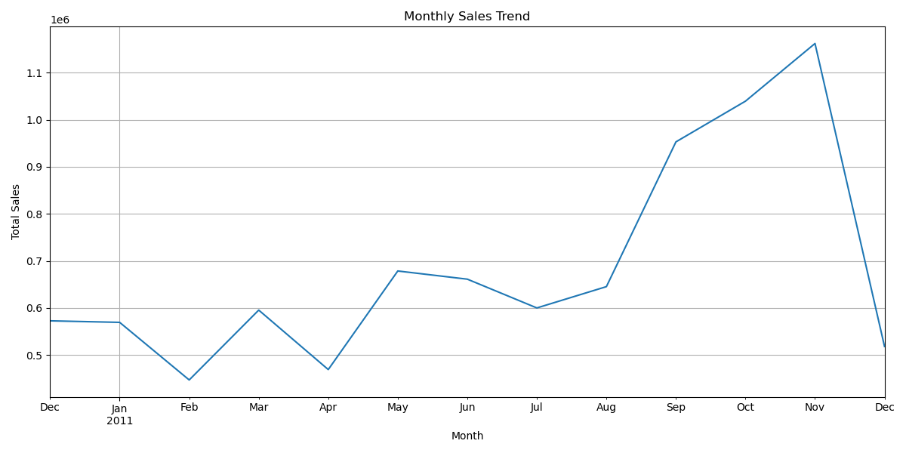
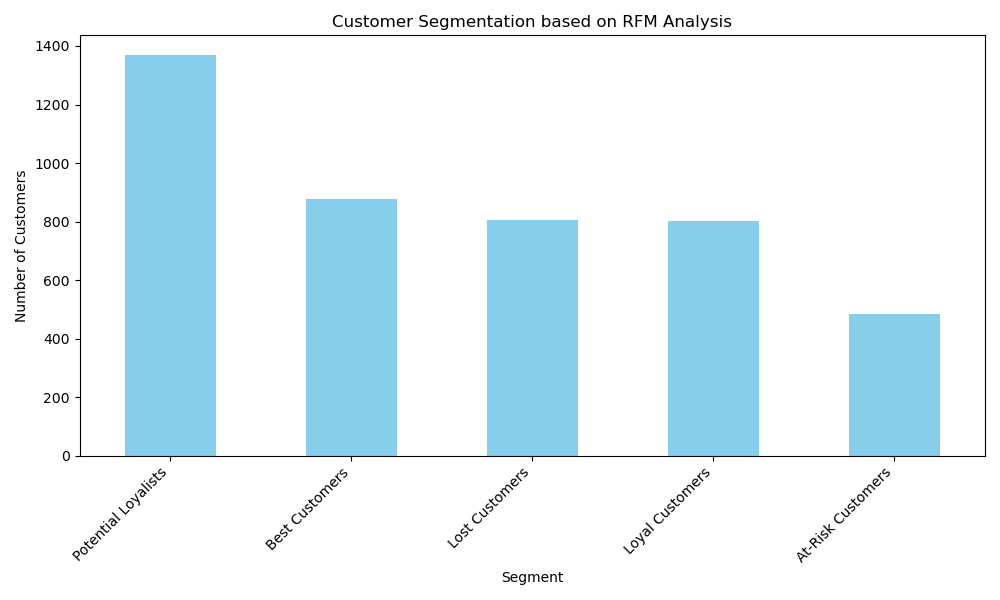

# E-commerce Sales Data Analysis

## 專案簡介

本專案旨在分析一份電子商務的交易資料，透過資料清理、探索性資料分析 (EDA) 以及顧客分群 (RFM)，挖掘出有價值的商業洞見。

## 資料來源

本專案使用的資料集為一份包含從 2010 年 12 月 1 日至 2011 年 12 月 9 日的真實線上零售交易資料。

* **原始資料**: `data.csv`

## 分析流程

### 1. 資料清理

* 移除 `CustomerID` 缺失的資料。
* 移除退貨 (`Quantity` < 0) 與免費商品 (`UnitPrice` = 0) 的訂單。
* 轉換 `InvoiceDate` 為日期格式。
* 新增 `TotalPrice` 欄位 (`Quantity` * `UnitPrice`)。
* 清理後的資料儲存於 `cleaned_ecommerce_data.csv`。

### 2. 探索性資料分析 (EDA)

#### a. 各國訂單數量分析

分析不同國家的訂單分佈，了解主要的市場在哪裡。

#### b. 熱銷商品分析

找出銷售數量最高的前十項商品。

#### c. 銷售趨勢分析

分析每個月的總銷售額，觀察銷售的季節性趨勢。

### 3. 顧客分群 (RFM Analysis)

使用 Recency (最近一次消費時間), Frequency (消費頻率), Monetary (消費金額) 將顧客分群，以了解顧客價值與行為。

* **RFM 分析結果**: `rfm_analysis.csv`

## 檔案結構

.
├── data.csv                     # 原始資料集
├── cleaned_ecommerce_data.csv   # 清理後的資料
├── rfm_analysis.csv             # RFM 分析結果
├── picture/                     # 存放所有分析圖表的資料夾
│   ├── country_distribution.png
│   ├── top_10_products.png
│   ├── monthly_sales_trend.png
│   └── rfm_customer_segmentation.png
└── README.md                    # 專案說明文件